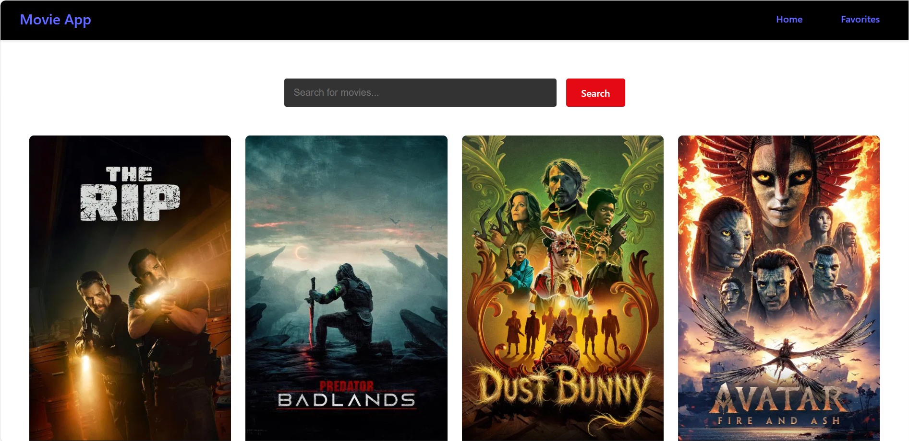

# 🎬 Movie App

A modern React web application that allows users to browse movie titles and save their favorite movies for easy access.

This app focuses on **discovery and organization**, not streaming — users can search for movies, view posters, and manage a favorites list.

---

## 🚀 Live Demo
👉 https://movie-list-tarik.vercel.app/

---

## 📸 Screenshot



---

## ✨ Features

- 🔍 Search for movies by title
- 🎞 View movie posters and titles
- ❤️ Add and remove movies from favorites
- ⚡ Fast and responsive UI
- 🧭 Simple navigation (Home / Favorites)

---

## 🛠 Tech Stack

- **React**
- **Vite**
- **JavaScript**
- **CSS**
- **Movie API** (TMDB)

---

## 📦 Installation

Clone the repository:
```bash
git clone https://github.com/your-username/movie-app.git
cd React_Movie/frontend
